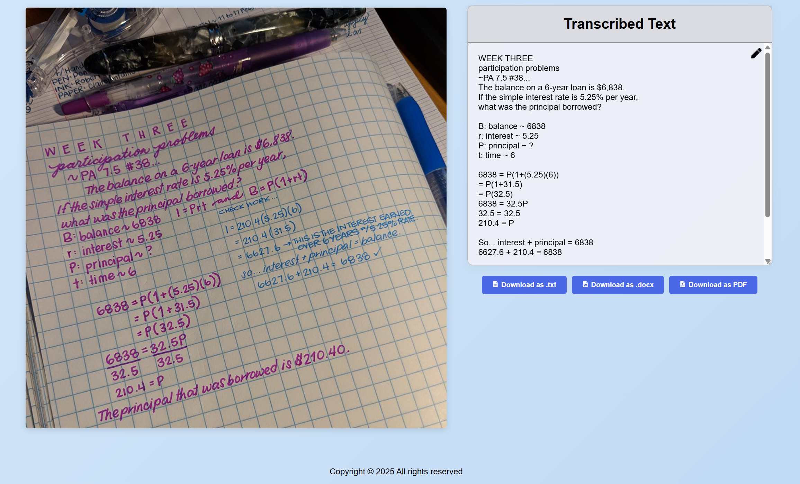

# Real-Time Whiteboard Transcription System (BoardCast)

## Overview

**BoardCast** is a real-time whiteboard transcription system that captures handwritten notes, mathematical formulas, and diagrams from images or videos of whiteboards, and transcribes them into organized, editable digital text. The system is designed for students, educators, and professionals to effortlessly document lectures, meetings, and brainstorming sessions.

- **Input:** Upload images or videos, or use a live video feed.
- **Output:** Download transcriptions as `.docx`, `.pdf`, or `.txt` files.
- **Core:** Advanced OCR, handwriting, and math recognition using AI/LLM models (Llama 4, Gemini, Nvidia NIM).
- **Interface:** Modern, user-friendly React web app with editing and export features.

---

## Features

- **Real-Time Transcription:** Processes live video feeds or uploaded images/videos with minimal latency.
- **Mathematical Formula Recognition:** Accurately transcribes mathematical symbols and equations.
- **Handwriting Recognition:** Converts various handwriting styles into clear, readable digital text.
- **Content Filtering:** Automatically excludes erased or irrelevant whiteboard content.
- **Export Options:** Download transcriptions as `.docx`, `.pdf`, or `.txt`.
- **User-Friendly Interface:** Responsive UI for easy interaction and review with timestamps.
- **Editing and Collaboration:** Edit transcriptions and add comments before export.
- **Comprehensive Testing:** 25 automated tests ensuring reliability.

---

## System Architecture

- **Frontend:** React.js, Material-UI
- **Backend:** Python (Flask), Llama 4 Scout LLM, Gemini 2.0 flash
- **Video Processing:** FFMPEG (frame extraction, enhancement)
- **APIs:** Nvidia NIM for Llama 4 Scout , Google AI Studio for Gemini 2.0 flash

### Project Structure

```
/Backend        # Python Flask server, OCR, AI/LLM integration
  /tests        # Comprehensive test suite
/Frontend       # React.js web application
/Docs           # Additional documentation and design docs
/requirements.txt # Python dependencies for backend
/launcher.py    # Windows launcher for both frontend and backend
/start_app.bat  # Batch file to launch the app on Windows
/LICENSE        # MIT License
```

---

## Installation & Setup

### 1. Clone the Repository

```bash
git clone https://github.com/ArielBlinder/Real-Time-Whiteboard-Transcription-System.git
cd Real-Time-Whiteboard-Transcription-System
```

### 2. Backend Setup (Python)

- **Requirements:** Python 3.8+
- **Install dependencies:**

```bash
pip install -r requirements.txt
```

- **Environment Variables Setup:**
  
  The application uses `.env` file to securely manage API keys.
  
  1. **Copy the template file:**
     ```bash
     cp env_template.txt .env
     ```
  
  2. **Get your API keys:**
     - **NVIDIA API Key:** Get it from https://build.nvidia.com/settings/api-keys
     - **Google AI Studio API Key:** Get it from https://aistudio.google.com/apikey
  
  3. **Edit the `.env` file** and replace the placeholder values:
     ```env
     NVIDIA_API_KEY=your_actual_nvidia_api_key_here
     GEMINI_API_KEY=your_actual_gemini_api_key_here
     ```
  
  **Security Note:** The `.env` file is automatically ignored by Git to protect your API keys.

### 3. Frontend Setup (React)

- **Requirements:** Node.js (v18+), npm
- **Install dependencies:**

```bash
cd Frontend
npm install

```

### 4. FFMPEG Setup

**Required for video processing.**

#### Windows

1. **Download**  
   Get the latest `ffmpeg-git-essentials.7z` from:  
   [https://www.gyan.dev/ffmpeg/builds/](https://www.gyan.dev/ffmpeg/builds/)

2. **Extract**  
   Use 7-Zip or WinRAR to extract the archive to:

   ```
   C:\ffmpeg
   ```

3. **Add to PATH**

   - Open **Start** → search: `Edit environment variables for your account`
   - Under **User variables**, select `Path` → click **Edit**
   - Click **New** → paste:
     ```
     C:\ffmpeg\bin
     ```
   - Press **Enter**, then click **OK**

4. **Verify Installation**  
   Open Command Prompt and run:
   ```bash
   ffmpeg -version
   ```

#### macOS

**Install with Homebrew:**

```bash
brew install ffmpeg
```

_Don't have Homebrew? Install it from: https://brew.sh_

**Verify Installation:**

```bash
ffmpeg -version
```

#### Linux

**Install FFmpeg:**

```bash
sudo apt update
sudo apt install ffmpeg
```

**Verify Installation:**

```bash
ffmpeg -version
```

### 5. Quick Start (Windows)

- Double-click `start_app.bat` to launch both frontend and backend, and open the app in your browser.

### 6. Manual Start (All Platforms)

- **Backend:**

  ```bash
  cd Backend
  python app.py

  ```

- **Frontend:**

  ```bash
  cd Frontend
  npm run dev

  ```

- Open [http://localhost:5173](http://localhost:5173) in your browser.

---

## Usage

1. **Upload** an image or video of a whiteboard, or select a video.
2. **Transcription** is performed automatically.
3. **Review & Edit** the generated text. Make corrections or add comments as needed.
4. **Export** the final transcription as `.docx`, `.pdf`, or `.txt`.

---

## Example

### Image Transcription


_Example of transcribing handwritten math problems from a whiteboard image_

### Video Transcription


_Real-time transcription of educational content from video with timeline support_

---

## Requirements

- Python 3.8+
- Node.js 18+
- FFMPEG (in PATH)
- Nvidia NIM API key
- Google AI Studio API key

### Python Dependencies (from `requirements.txt`)

- Flask, flask-cors, Pillow, requests, psutil, pywin32

### Frontend Dependencies (from `package.json`)

- React, react-dom, react-icons, docx, file-saver, jspdf, @fortawesome/free-solid-svg-icons, react-router-dom, etc.

---

## Testing & Development

The project includes a comprehensive test suite with 25 tests covering all aspects of the system:

### **Test Suite Overview**

- **Total Tests:** 25 (18 unit + 4 integration + 1 performance + 2 edge cases)
- **Test Categories:**
  - **Unit Tests:** Fast, mocked dependencies (API key validation, image processing, NVIDIA OCR, Gemini processing, Flask routes)
  - **Integration Tests:** Real API calls (NVIDIA OCR, Gemini, end-to-end pipeline)
  - **Performance Tests:** Benchmarking and scaling validation
  - **Edge Case Tests:** Boundary conditions and error handling

### **Running Tests**

```bash
# Navigate to Backend directory
cd Backend

# Install test dependencies
pip install -r tests/test_requirements.txt

# Run ALL tests
python tests/run_tests.py

```

## Authors & Credits

- **Ariel Blinder**
- **Saar Attarchi**

---

## Troubleshooting & FAQ

- **FFMPEG not found:** Ensure `ffmpeg` is installed and in your system PATH, refer to the "Required for video processing" section
- **API errors:** Double-check your API keys and network connection.
- **Test failures:** Run `python tests/run_tests.py` to validate system functionality.
- **Windows users:** Use `start_app.bat` for easiest startup.
- **Other issues:** Please open an issue or check the [Docs](./Docs) folder for more details.

---

## Related & Further Reading

- See `/Docs` for detailed design, requirements, and competitor analysis.
- See `Backend/tests/README.md` for comprehensive testing documentation.
- For FFMPEG help: [FFMPEG Documentation](https://ffmpeg.org/documentation.html)
- For Nvidia NIM and Google AI Studio API docs, see their respective official sites.

---

## License

This project is licensed under the MIT License. See [LICENSE](./LICENSE) for details.

---
